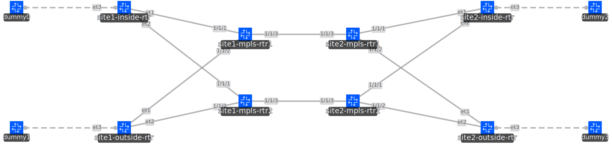

# Segment Routing with EVPN and VPWS
## Lab Description Summary
This lab contains an example of an MPLS core with segment routing with four disparate EVPN-VPWS services running across. Additionally there are 3rd-party vendor routers which directly peer BGP with each other across the core.

## Diagram


## Lab Notes
### EPIPE (VPWS) Config
The epipe configuration is the unique part of this configuration and is fairly simple. The local and remote attachpoint-circuits have an eth-tag attribute which is signalled in the EVPN auto-discovery routes and what is used for each device to recognize each other as ends of the same circuit. These values must be unique pairs for each circuit and should mirror each other between the local router and the remote router.

```
configure service epipe "inside-1" admin-state enable
configure service epipe "inside-1" description "VPWS for inside-1"
configure service epipe "inside-1" service-id 101
configure service epipe "inside-1" customer "tenant1"
configure service epipe "inside-1" bgp 1 route-distinguisher "11.11.11.11:1001"
configure service epipe "inside-1" bgp 1 route-target export "target:1001:1001"
configure service epipe "inside-1" bgp 1 route-target import "target:1001:1001"
configure { service epipe "inside-1" sap 1/1/1 }
configure service epipe "inside-1" bgp-evpn local-attachment-circuit "local" eth-tag 1001
configure service epipe "inside-1" bgp-evpn remote-attachment-circuit "remote" eth-tag 2001
configure service epipe "inside-1" bgp-evpn mpls 1 admin-state enable
configure service epipe "inside-1" bgp-evpn mpls 1 auto-bind-tunnel resolution filter
configure service epipe "inside-1" bgp-evpn mpls 1 auto-bind-tunnel resolution-filter sr-isis true
```

## Validation
### IS-IS Adjacency

```
A:admin@site1-mpls-rtr1-a# show router isis adjacency 

===============================================================================
Rtr Base ISIS Instance 0 Adjacency 
===============================================================================
System ID                Usage State Hold Interface                     MT-ID
-------------------------------------------------------------------------------
site2-mpls-rtr1-a        L2    Up    20   to-site2-mpls-rtr1            0
-------------------------------------------------------------------------------
Adjacencies : 1
===============================================================================
```

### MPLS Tunnel-Table

```
A:admin@site1-mpls-rtr1-a# show router tunnel-table

===============================================================================
IPv4 Tunnel Table (Router: Base)
===============================================================================
Destination           Owner     Encap TunnelId  Pref   Nexthop        Metric
   Color                                                              
-------------------------------------------------------------------------------
10.11.21.21/32        isis (0)  MPLS  524289    11     10.11.21.21    0
21.21.21.21/32        isis (0)  MPLS  524290    11     10.11.21.21    10
-------------------------------------------------------------------------------
Flags: B = BGP or MPLS backup hop available
       L = Loop-Free Alternate (LFA) hop available
       E = Inactive best-external BGP route
       k = RIB-API or Forwarding Policy backup hop
===============================================================================
```


The detailed output includes the transport label information used to reach the destination routers:

```
A:admin@site1-mpls-rtr1-a# show router tunnel-table detail

===============================================================================
Tunnel Table (Router: Base)
===============================================================================
Destination      : 10.11.21.21/32
NextHop          : 10.11.21.21
Tunnel Flags     : is-adjacency-tunnel
Age              : 00h37m26s
CBF Classes      : (Not Specified)
Owner            : isis (0)             Encap            : MPLS
Tunnel ID        : 524289               Preference       : 11
Tunnel Label     : 3                    Tunnel Metric    : 0
Tunnel MTU       : 8918                 Max Label Stack  : 1
-------------------------------------------------------------------------------
Destination      : 21.21.21.21/32
NextHop          : 10.11.21.21
Tunnel Flags     : (Not Specified)
Age              : 00h37m25s
CBF Classes      : (Not Specified)
Owner            : isis (0)             Encap            : MPLS
Tunnel ID        : 524290               Preference       : 11
Tunnel Label     : 12021                Tunnel Metric    : 10
Tunnel MTU       : 8918                 Max Label Stack  : 1
-------------------------------------------------------------------------------
Number of tunnel-table entries          : 2
Number of tunnel-table entries with LFA : 0
===============================================================================
```


### Router BGP Summary

```
A:admin@site1-mpls-rtr1-a# show router bgp summary

<output truncated>

===============================================================================
BGP Summary
===============================================================================
Legend : D - Dynamic Neighbor
===============================================================================
Neighbor
Description
                   AS PktRcvd InQ  Up/Down   State|Rcv/Act/Sent (Addr Family)
                      PktSent OutQ
-------------------------------------------------------------------------------
21.21.21.21
                65500       7    0 00h00m55s 2/2/2 (Evpn)
                            7    0
```

### EVPN Auto-Discovery Routes
When doing VPLS over EVPN there is no need for mac-learning and therefore the only EVPN route-types required are type-1 auto-discovery routes.

```
A:admin@site1-mpls-rtr1-a#    show router bgp routes evpn auto-disc 
===============================================================================
 BGP Router ID:11.11.11.11      AS:65500       Local AS:65500      
===============================================================================
 Legend -
 Status codes  : u - used, s - suppressed, h - history, d - decayed, * - valid
                 l - leaked, x - stale, > - best, b - backup, p - purge,
                 w - unused-weight-only
 Origin codes  : i - IGP, e - EGP, ? - incomplete

===============================================================================
BGP EVPN Auto-Disc Routes
===============================================================================
Flag  Route Dist.         ESI                           NextHop
      Tag                                               Label
-------------------------------------------------------------------------------
u*>i  21.21.21.21:1001    ESI-0                         21.21.21.21
      2001                                              LABEL 524287

u*>i  21.21.21.21:1002    ESI-0                         21.21.21.21
      2002                                              LABEL 524286

-------------------------------------------------------------------------------
Routes : 2
===============================================================================
```

> [!NOTE]
> The MPLS label listed under the BGP EVPN route above is *not* the transport label
> used for routing to the remote router (which is seen the the `show mpls tunnel-table
> detail` command), but rather this label identifies the specific overlay service and
> sits below the transport labels in the stack. The remote router will read this label
> to place the traffic into the correct VPN service.